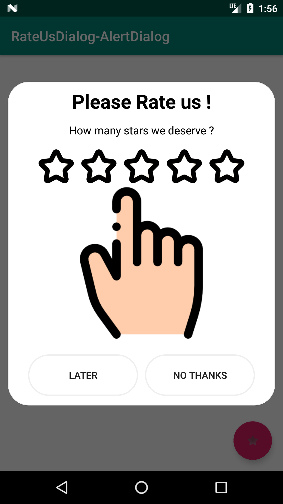
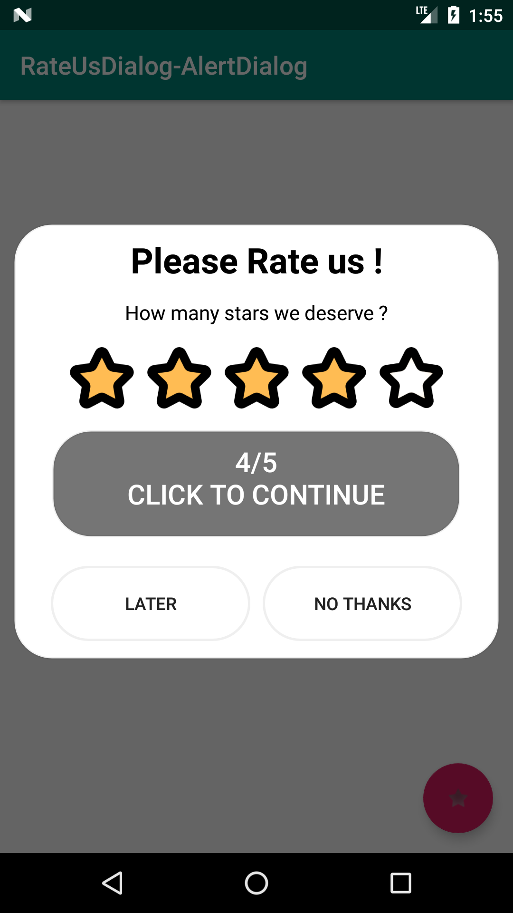

# RateUsAlertDialog
Modern Rate Us Dialog
this project based on guy-4444 his <a href="https://github.com/guy-4444/SmartRateUsDialog-Android">Project</a> use the same logic with a few lings code change and  different UI. 
# UI
||||
# Usage
### Step 1. Add the JitPack repository to your build file
 Add it in your root build.gradle at the end of repositories:
```
	allprojects {
		repositories {
			...
			maven { url 'https://jitpack.io' }
		}
	}
```

### Step 2. Add the dependency
```
	dependencies {
	        implementation 'com.github.HmimssaSoufiane:RateUsAlertDialog:1.0.0'
		}
```
###

#### for more details about the algorithmes workflows check the base <a href="https://github.com/guy-4444/SmartRateUsDialog-Android">Project</a> its contains a the Logigramme.
